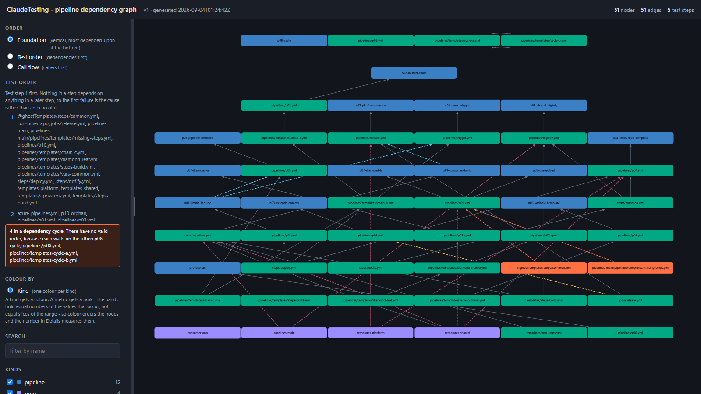

# PSAzureDevOpsGraph

[](docs/worklog/v0.4.0.md)
[](#read-only-permanently)
[](src/PSAzureDevOpsGraph/PSAzureDevOpsGraph.psd1)
[](LICENSE)

Works out which Azure DevOps pipelines depend on what.



<sup>A real project — 15 pipelines, 30 YAML files, 4 repositories. The two
orange nodes are references that resolve to nothing; the sidebar names the four
nodes stuck in a dependency cycle. Open
[the report](examples/claudetesting.html).</sup>

## Examples

| Example | What it shows | Artifacts | Regenerate |
| --- | --- | --- | --- |
| **ClaudeTesting** | 51 nodes and 51 edges across one project, including two unresolved template references and a four-node dependency cycle. | [html](examples/claudetesting.html) · [graph json](examples/input/claudetesting-graph.json) · [png](examples/claudetesting.png) | `pwsh -NoProfile -File examples/Build-Examples.ps1` |

That command reads the live project, so it needs `$env:AZDO_PAT` to hold a
token with **Code (Read)** and **Build (Read)** — read from the environment by
name, never written anywhere. Without a token, rebuild the HTML from the
committed graph with `pwsh -NoProfile -File examples/Build-Examples.ps1
-Offline`: no network, same output.

See [`examples/README.md`](examples/README.md) for the full index, what each
colour means, and why unresolved references are carried rather than dropped.

## The question it answers

Azure DevOps pipeline YAML composes by reference. A pipeline pulls in templates,
templates pull in other templates, and those references cross repository
boundaries — so the thing you most want to know is not visible from any one
file:

> **If I change this template, which pipelines break?**

`PSAzureDevOpsGraph` reads a project through the REST API and returns the whole
dependency graph as data: the pipelines, the YAML files they reference, the
repositories those files live in, and the edges between them — including the
references it could **not** resolve, which are the ones worth hearing about.

## Read-only, permanently

The module never queues, runs, or triggers a pipeline, and never creates,
updates, or deletes anything in Azure DevOps. Every REST call it makes is a
`GET`. There is no `-Force` that changes this and no command whose name begins
with a writing verb — a test in `tests/` asserts that, by enumerating the
exported surface.

## Credentials

A personal access token, read from `$env:AZDO_PAT`, and nothing else.

Not a parameter, not a file path, never placed in a URL. A value passed as a
parameter ends up in `PSReadLine` history, in `Start-Transcript` output, and in
the ScriptBlock logging event log — and a PAT is a bearer credential for an
entire organisation. If the variable is absent, commands fail with a message
naming it; they do not prompt and do not fall back to anything.

The token needs **Code (Read)** and **Build (Read)**.

```powershell
$env:AZDO_PAT = '<paste your token here, in your own shell>'
```

## Install

Not published to the PowerShell Gallery. Clone a tag and build it:

```powershell
git clone --branch v0.4.0 https://github.com/JerryBalmer1/PSAzureDevOpsGraph.git
cd PSAzureDevOpsGraph
Install-Module powershell-yaml -Scope CurrentUser   # the one runtime dependency
./build.ps1                                          # Clean, Lint, Build, Test
Import-Module ./output/PSAzureDevOpsGraph/PSAzureDevOpsGraph.psd1
```

Requires PowerShell 7.2 or later.

`main` always points at the newest `v0.<minor>.0` tag, by fast-forward only
([decision 0008](https://github.com/JerryBalmer1/AI.Agent.Claude.PowerShellModuleBuilder/blob/main/decisions/0008-target-main-follows-tags.md)),
so cloning `main` and cloning the newest tag get you the same tree. The `run-*`
branches are **not** releases — see [How this module was measured](#how-this-module-was-measured).

## Usage

All three examples below are real output from the fixture project used to
develop the module — 15 pipeline definitions across 4 repositories.

### 1. Get the whole graph

```powershell
$graph = Get-AzDoPipelineDependencyGraph -Organisation myorg -Project MyProject
$graph.nodes | Group-Object kind | Select-Object Count, Name
```

```text
Count Name
----- ----
   15 pipeline
    4 repo
   30 yaml
```

51 edges: 21 `template`, 15 `definition`, 8 `repositoryResource`,
3 `pipelineResource`, 2 `unresolved`, 1 `extends`, 1 `checkout`.

### 2. Find the broken references

The point of the tool. A reference that cannot be resolved is reported with a
reason, never dropped — a broken pipeline that vanishes from the output looks
identical to a clean one.

```powershell
$graph.edges | Where-Object kind -eq 'unresolved' | Format-List from, ref, reason
```

```text
from   : yaml:pipelines-main/pipelines/p09.yml
ref    : steps/common.yml@ghostTemplates
reason : alias-not-declared: 'ghostTemplates' is not in resources.repositories of
         pipelines/p09.yml, so the repository is unknown and the path cannot be
         resolved at all

from   : yaml:pipelines-main/pipelines/p09.yml
ref    : templates/missing-steps.yml
reason : file-not-found: resolved to pipelines/templates/missing-steps.yml in
         pipelines-main, which does not exist
```

The two reasons stay distinct because they need different fixes: one is a
missing file, the other a missing `resources.repositories` entry.

### 3. Answer the actual question

```powershell
$target = 'yaml:pipelines-main/pipelines/templates/steps-build.yml'
$graph.edges | Where-Object to -eq $target | Select-Object from, kind, ref
```

```text
from                                  kind     ref
----                                  ----     ---
yaml:pipelines-main/pipelines/p01.yml template templates/steps-build.yml
```

Note what this does **not** match. `pipelines-main` also holds
`templates/steps-build.yml` at its root, and a cross-repository reference
`templates/steps-build.yml@mainPipelines` resolves there instead. Same text,
two rules, two files — a resolver that joins every reference to the repository
root returns the wrong one without erroring.

### Export it

```powershell
$graph | Export-AzDoPipelineDependencyGraph -Path ./graph.json              # JSON
$graph | Export-AzDoPipelineDependencyGraph -Path ./graph.dot  -Format Dot  # Graphviz
$graph | Export-AzDoPipelineDependencyGraph -Path ./graph.html -Format Html # standalone page
```

The HTML is self-contained: no external script, stylesheet, `@import`, or
`http(s)` reference of any kind, so it opens from a `file://` URL with no
network.

## Commands

| Command | Does |
|---|---|
| `Get-AzDoRepository` | The Git repositories in a project. |
| `Get-AzDoPipeline` | The pipeline definitions, each with the repository and path its YAML lives at. |
| `Get-AzDoPipelineYaml` | The YAML text at a path, or `$null` if absent. |
| `Get-AzDoPipelineReference` | The references in one document. Parsing only — no resolution, no network. |
| `Resolve-AzDoPipelineReference` | One reference to a repository and path, or an unresolved result with a reason. |
| `Get-AzDoPipelineDependencyGraph` | The graph: nodes and edges. |
| `Export-AzDoPipelineDependencyGraph` | The graph as JSON, DOT or HTML. |

Parsing and resolution are separate commands on purpose. Parsing is testable
against a file on disk with no credentials and no network; resolution needs to
know what exists in which repository. A combined command reports resolution
failures as parsing results, with no way to tell which half was wrong.

## How references resolve

| Reference | Resolves |
|---|---|
| `templates/x.yml` | relative to the **directory of the file** making the reference |
| `templates/x.yml@alias` | from the **root** of the repository `alias` names |

The alias is looked up in the `resources.repositories` of the file making the
reference, and the current repository is a property of the file rather than of
the traversal — so a relative reference inside a cross-repository template stays
in that template's repository.

`checkout: self` produces nothing. `checkout: <alias>` is a dependency on that
repository and never a template reference. `extends.template` is its own edge
kind. A parameter named `buildTemplate` is not a reference, however much its
value looks like a path.

## How this module was measured

This repository is the **deliverable line** of a measurement harness,
[AI.Agent.Claude.PowerShellModuleBuilder][harness]. The module exists because
something had to be built in order to measure how much an agent plugin helps
build it, and the numbers below are that harness's, not this repository's.

Nothing here is re-argued. Every figure links the artifact that produced it,
and every bound the harness states is carried across. The consolidated table
with all five runs side by side is [in the harness README][table].

### Two lines run through this repository, and they are never compared

- **The deliverable line** — `main` and its `v0.<minor>.0` tags. This is what
  you clone. Each plan that touches the module commits here and tags it
  ([decision 0006][d0006]), and `main` follows the newest tag by fast-forward
  ([decision 0008][d0008]).
- **The measurement line** — the `run-*` branches. Each is an orphan root
  produced by wiping the repository back to a four-file seed, so a run measures
  what an agent builds from nothing. They are never merged to `main`, never
  tagged, and are not releases.

Everything below happened on the measurement line. The module you install is
run 002's build, carried forward.

### Run 002 — this module's own build, and what it is not

[Run 002][r002] is the build this repository ships.

| Gate | Result |
|---|---|
| Build | exit 0 — analyzer clean, 37/37 tests, 82.88% coverage against a 40% target |
| Conformance (shape) | 57/57 cases across 33 assertions |
| Functional (behaviour) | 12/12 cases — the produced graph equals the hand-written oracle exactly, 0 differences |

**This is not a zero-skill baseline and it is not a comparative result.** The
plugin was seeded before the run and the builder read the fixture's case list as
a specification, taking one output convention out of the oracle. The run's own
record says so in a standing block-quote, and comparative scoring starts at run
003. Read 12/12 as *the module works*, not as evidence about the plugin
([run 002 findings][r002f], F-1).

### The ladder — runs 004, 005 and 006

Three consecutive plugin-on runs from wiped state: same seed, same brief, same
fixture, same oracle, same plugin SHA, same pinned model version, three distinct
sessions. The variance between them is the finding.

| | [004][r004] | [005][r005] | [006][r006] |
|---|---|---|---|
| conformance, first shot (cases-defined) | **33 / 33** | **33 / 33** | **33 / 33** |
| conformance, final | 33 / 33 | 33 / 33 | 33 / 33 |
| conformance cases-run | 57 | 56 | 57 |
| functional, first shot | 1 / 12 | 1 / 12 | 1 / 12 |
| **functional, final** | **12 / 12** | **12 / 12** | **12 / 12** |
| iterations used, of 3 allowed | **1** | **1** | **2** |
| first-shot differences | 26 | 26 | 26 |
| Phase 1 wall clock | 33 min | 23 min | 34 min |

**First-shot conformance held at 33/33 three times**, each scored from a fresh
clone built from nothing, so the number is not an artifact of a working tree.
All three reached the functional oracle exactly. Runs 004 and 005 were
difference-for-difference identical — the same 26 differences by the same four
mechanisms, zero structural edge errors each — and 006 reproduced every graded
line of it, spending one extra iteration because its first fix had branched on
the *text* of the `reason` field it was improving.

Conformance is scored per assertion against `cases-defined`, the denominator
that does not move with the module's shape. `cases-run` is printed beside it
because [decision 0003][d0003] requires both wherever two scores are compared:
run 005 shipped no culture directory, so one assertion graded nothing and was
reported skipped rather than passed.

### The control — run 007

[Run 007][r007] is the same task with the plugin present on disk and **unread**,
given the ladder's three-iteration budget so that it is a control rather than a
handicap.

| | ladder (004 / 005 / 006) | **007, plugin off** |
|---|---|---|
| conformance, first shot | 33 / 33, three times | **19 / 33** |
| conformance, final | 33 / 33 | **28 / 33** — 32/33 re-scored in a built clone |
| functional, first shot | 1 / 12 | **6 / 12** |
| first-shot differences | 26 | **14** |
| **functional, final** | **12 / 12** | **12 / 12** |
| iterations to 12/12 | 1 / 1 / 2 | **1** |
| Phase 1 wall clock | 33 / 23 / 34 min | **181 min** |

The functional score is dominated by one omitted property, so it hides the
result. The difference *breakdown* does not:

| Mechanism | 003 off | 004 / 005 / 006 on | 007 off, iterated |
|---|---:|---:|---:|
| `repo` omitted from `pipeline` nodes | 15 | 15 | **0** |
| `alias` written where the oracle omits it | 8 | 8 | 8 |
| `reason` written as a bare token | 2 | 2 | 2 |
| unresolved targets given colliding ids | 2 | **0** | 2 |
| the empty repository emitted as a node | 1 | **0** | 1 |
| `checkout: self` turned into an edge | 1 | **0** | 1 |
| `repo:consumer-app` missing | 0 | **1** | 0 |
| **total** | **29** | **26** | **14** |

The plugin prevents three behavioural errors at first shot — rules the skills
state and the brief does not — and the control makes all three and has them
fixed by iteration 1. The plugin changed nothing about the two conventions it
does not state, `alias` and the `reason` format: four blind sessions guessed,
and all four guessed the same two things wrong in the same direction. And the
plugin introduced one error of its own — `azdo-graph-assembly` states the
repository-node rule too narrowly, so every run that follows it exactly is
missing one node.

### The sentence the control forced

> Across three plugin-on runs and one plugin-off control, all four modules
> reached the functional oracle exactly — 12/12, zero differences — within two
> fix iterations, and the control's first shot was the closest of the four.
> What the plugin reliably supplies is first-shot conformance to house style,
> which is not derivable from the brief: plugin-on runs scored 33/33 at first
> shot and held it, while the control started at 19/33 and reached 28/33 only
> by spending two of its three iterations on house conventions alone. **On the
> evidence so far the plugin buys shape, not correctness** — and a single
> control cannot tell us whether that is because the conventions are the hard
> part, or because the dependency computation was never the hard part for this
> model.

That sentence was drafted inside [run 007's own record][r007] and is quoted
here rather than restated. The measured, repeatable effect is **19/33 → 33/33
at first shot, three times** — about fourteen house-style assertions covering
the build file, the generated `.psm1`, one-function-per-file and the root
files. Re-derived under the corrected procedure below it is 20/33 → 33/33,
thirteen assertions.

### Three bounds that travel with every number above

None of them is small enough to leave in a footnote nobody reads.

- **Every run read a fixture that names its own cases.** The `ClaudeTesting`
  YAML carries comments identifying each case and stating what it is for.
  Reading the fixture through the module is what the task *is*, so every run
  has read them by design and always will — the fixture is frozen. **"Blind"
  in this project means the oracle, the prior run records and the plugin were
  unread. It has never meant the fixture was unread.** It is the most plausible
  account of why the dependency traversal was right at first shot in every run
  while the output conventions were not. ([Hazard 13][harnessmd].)

- **Run 007's first-shot figures are contaminated by its own prompt.** A
  measured run's prompt is inside its own read-allowlist, and this one named
  four convention mechanisms and their counts before the builder wrote a line.
  Three of the four recurred anyway; the fourth — the 15-difference
  `repo`-on-`pipeline` mechanism — did not, and it is exactly the one a leak
  would most plausibly have prevented. **The 6/12 and the 14 differences cannot
  be separated from "was told part of the answer", and the claim that the
  control's first shot was closest rests on them.** Run 006's prompt leaked the
  same list, weakening its first-shot number the same way.
  ([Run 007 findings][r007f] C-2, [hazard 12][harnessmd].)

- **The conformance scoring procedure was defective and is now fixed, so two
  numbers are printed.** Four `RequiresBuild` assertions read the build output
  directory, which is gitignored; the protocol said *score from a fresh clone*
  and never said to build it. Run 007's conformance clone was not built, so it
  reported 28/33 where the same commit built first scores **32/33**, and its
  first shot moves 19/33 → 20/33 the same way. The ladder runs were unaffected
  — each had build output in its conformance tree by a different improvised
  route, which is why nobody noticed. The rule is now written down in
  [`Score-Clone.ps1`][scoreclone] and the re-derived numbers are in
  [`rescore.txt`][rescore].

### What none of it establishes

The functional score says the graph matches a hand-written oracle for one
15-pipeline fixture. **This module has never been run against a real project of
any size**, there is no paging test against a project large enough to page, and
performance is unmeasured beyond *13.4 seconds for 30 files*. Known gaps are in
each run's findings, linked below.

One control, itself contaminated by its own prompt, against three runs of one
instrument on one fixture, cannot separate *the conventions are the hard part*
from *the dependency computation was never hard for this model*.

### Every record behind the numbers

| Run | What it was | Record |
|---|---|---|
| 002 | first build; plugin seeded, case list read | [runs/002-first-build][r002] |
| 003 | plugin off, **no fix loop permitted** — 0/12 first shot, 19/33 | [runs/003-baseline-off][r003] |
| 004 | plugin on | [runs/004-plugin-on][r004] |
| 005 | plugin on | [runs/005-plugin-on][r005] |
| 006 | plugin on | [runs/006-plugin-on][r006] |
| 007 | plugin off, iterated — the control | [runs/007-baseline-iterated][r007] |

Each directory holds the graph that run produced, its diff against the oracle,
its `conformance-result.json`, its findings sorted by mechanism, and the
commands that produced all of it. A run is never deleted or edited because its
answer was bad.

[harness]: https://github.com/JerryBalmer1/AI.Agent.Claude.PowerShellModuleBuilder
[table]: https://github.com/JerryBalmer1/AI.Agent.Claude.PowerShellModuleBuilder/blob/main/README.md#with-the-plugin-and-without-it
[harnessmd]: https://github.com/JerryBalmer1/AI.Agent.Claude.PowerShellModuleBuilder/blob/main/evals/HARNESS.md
[scoreclone]: https://github.com/JerryBalmer1/AI.Agent.Claude.PowerShellModuleBuilder/blob/main/evals/conformance/Score-Clone.ps1
[rescore]: https://github.com/JerryBalmer1/AI.Agent.Claude.PowerShellModuleBuilder/blob/main/plans/0033-honest-headline/rescore.txt
[d0003]: https://github.com/JerryBalmer1/AI.Agent.Claude.PowerShellModuleBuilder/blob/main/decisions/0003-score-comparability.md
[d0006]: https://github.com/JerryBalmer1/AI.Agent.Claude.PowerShellModuleBuilder/blob/main/decisions/0006-target-versioning-and-tags.md
[d0008]: https://github.com/JerryBalmer1/AI.Agent.Claude.PowerShellModuleBuilder/blob/main/decisions/0008-target-main-follows-tags.md
[r002]: https://github.com/JerryBalmer1/AI.Agent.Claude.PowerShellModuleBuilder/tree/main/runs/002-first-build
[r002f]: https://github.com/JerryBalmer1/AI.Agent.Claude.PowerShellModuleBuilder/blob/main/runs/002-first-build/findings.md
[r003]: https://github.com/JerryBalmer1/AI.Agent.Claude.PowerShellModuleBuilder/tree/main/runs/003-baseline-off
[r004]: https://github.com/JerryBalmer1/AI.Agent.Claude.PowerShellModuleBuilder/tree/main/runs/004-plugin-on
[r005]: https://github.com/JerryBalmer1/AI.Agent.Claude.PowerShellModuleBuilder/tree/main/runs/005-plugin-on
[r006]: https://github.com/JerryBalmer1/AI.Agent.Claude.PowerShellModuleBuilder/tree/main/runs/006-plugin-on
[r007]: https://github.com/JerryBalmer1/AI.Agent.Claude.PowerShellModuleBuilder/tree/main/runs/007-baseline-iterated
[r007f]: https://github.com/JerryBalmer1/AI.Agent.Claude.PowerShellModuleBuilder/blob/main/runs/007-baseline-iterated/findings.md

## Where the reasoning lives

| File | Read it when |
|---|---|
| [`docs/HANDOFF.md`](docs/HANDOFF.md) | **first.** What this is, the two lines, how `main` and tags move, the version ledger, what is open |
| `docs/worklog/` | why a tag did what it did |

## Licence

MIT. See [LICENSE](LICENSE).
